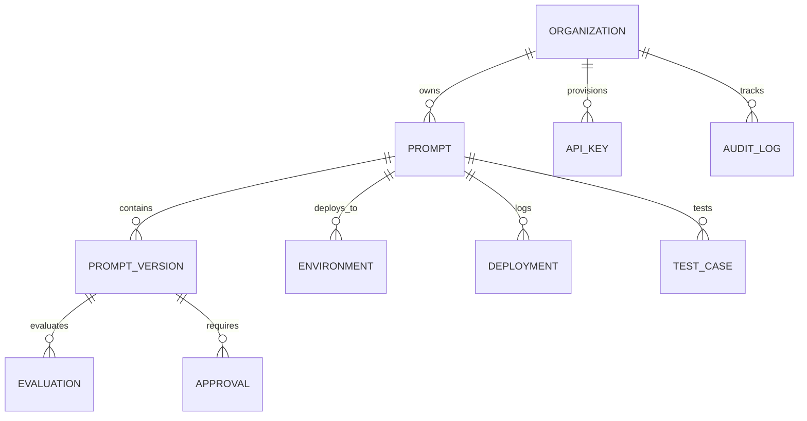

# System Architecture & Technical Design

## Overview

**AI Prompt Registry** is open-source developer infrastructure designed for prompt versioning, testing, deployment, evaluation, and observability. It treats prompts as versioned, immutable production artifacts—analogous to Git and npm for prompt engineering.

```mermaid
flowchart TD
    CLI["CLI (@ai-prompt-registry/cli)"] --> API["Fastify API Gateway (apps/api)"]
    SDK["TypeScript SDK (@ai-prompt-registry/sdk)"] --> API
    MCP["MCP Server (@ai-prompt-registry/mcp)"] --> API
    DASH["Next.js Web UI (apps/dashboard)"] --> API

    subgraph Core Engine ["Core Logic (@ai-prompt-registry/core)"]
        DIFF["Diff Engine"]
        EVAL["Deterministic Evaluators"]
        POLICY["Policy Gate Engine"]
        RENDER["Sandboxed Renderer"]
    end

    API --> Core Engine
    API --> Storage["Storage Layer"]
    Storage --> PG[("PostgreSQL Database")]
    Storage --> MEM[("In-Memory Store (Dev)")]
```

---

## Workspace Structure

The project is structured as a high-performance pnpm monorepo:

| Package / App | Path | Description |
| :--- | :--- | :--- |
| `@ai-prompt-registry/core` | `packages/core` | Canonical data schemas, semantic semver diff engine, deterministic evaluation algorithms, template renderers, and policy gates. |
| `@ai-prompt-registry/sdk` | `packages/sdk` | Idiomatic TypeScript client SDK with automatic retries, exponential backoff, request timeouts, and telemetry helpers. |
| `@ai-prompt-registry/mcp` | `packages/mcp` | Spec-compliant Model Context Protocol server exposing prompt management tools to AI IDEs (Claude Desktop, Cursor, etc.). |
| `@ai-prompt-registry/api` | `apps/api` | Fastify REST API providing authenticated multi-tenant access, database persistence, audit logging, and quality gates. |
| `@ai-prompt-registry/cli` | `apps/cli` | Developer CLI tool for prompt authoring, testing, pushing, pulling, and deployment. |
| `@ai-prompt-registry/dashboard` | `apps/dashboard` | Modern React/Next.js developer dashboard for visual prompt inspection, diffing, and playground simulation. |

---

## Data Model & Relational Integrity

All persistent records are partitioned by `organization_id` to guarantee tenant isolation at both the application and database tiers.



### Key Entities

1. **Prompt**: The top-level resource containing metadata (name, slug, description, type, tags, owner).
2. **Prompt Version**: An immutable snapshot of a prompt template, variable definitions, and model configurations identified by semver (e.g. `1.0.0`) and content checksum.
3. **Environment**: A deployment target (e.g. `production`, `staging`, `canary`). Environments with `isProtected: true` enforce policy gates and evaluation score thresholds before promotions.
4. **Deployment**: An atomic point-in-time association of a prompt version to an environment. Rollbacks create new deployment events pointing to the prior version.
5. **Evaluation & Test Case**: Quality gate test suites composed of input variable fixtures and deterministic assertions (`exact_match`, `contains`, `regex`, `json_validity`, `json_schema`).

---

## Versioning & Content Addressability

Prompt versions are strictly immutable once published. The registry computes a canonical SHA-256 checksum across sorted keys of the prompt definition:

$$\text{Checksum} = \text{SHA256}(\text{CanonicalJSON}(\text{Name}, \text{Version}, \text{Template}, \text{Variables}, \text{OutputSchema}))$$

In PostgreSQL storage, an explicit database trigger (`trg_prevent_published_version_mutation`) prevents updates to records in `published` or `approved` lifecycle states, eliminating Time-of-Check to Time-of-Use (TOCTOU) races.
